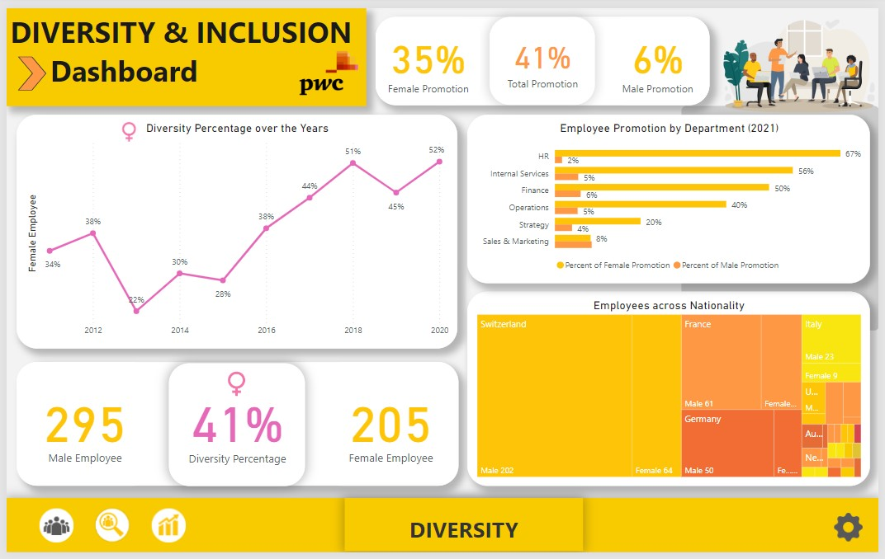
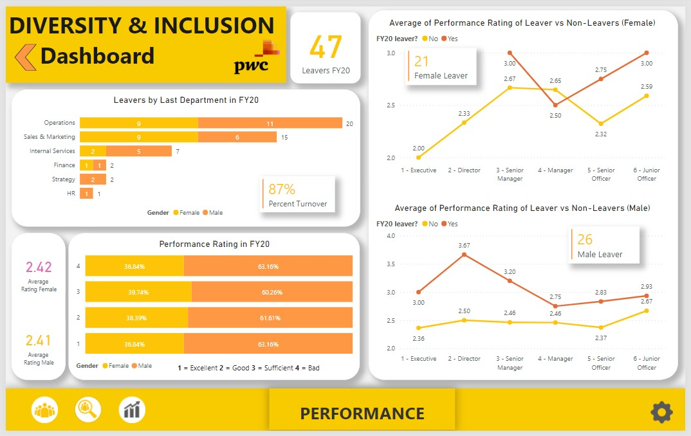
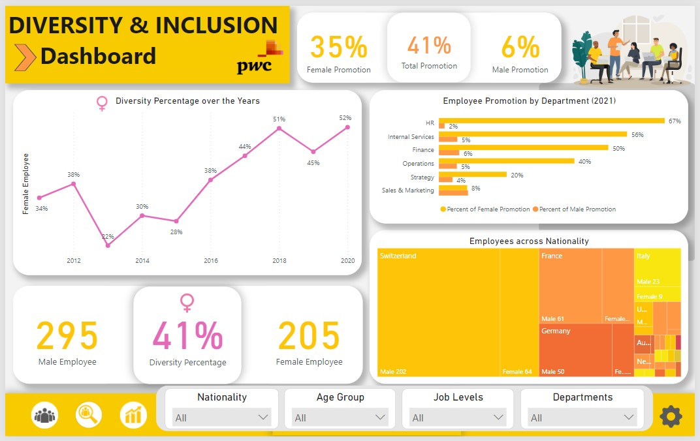
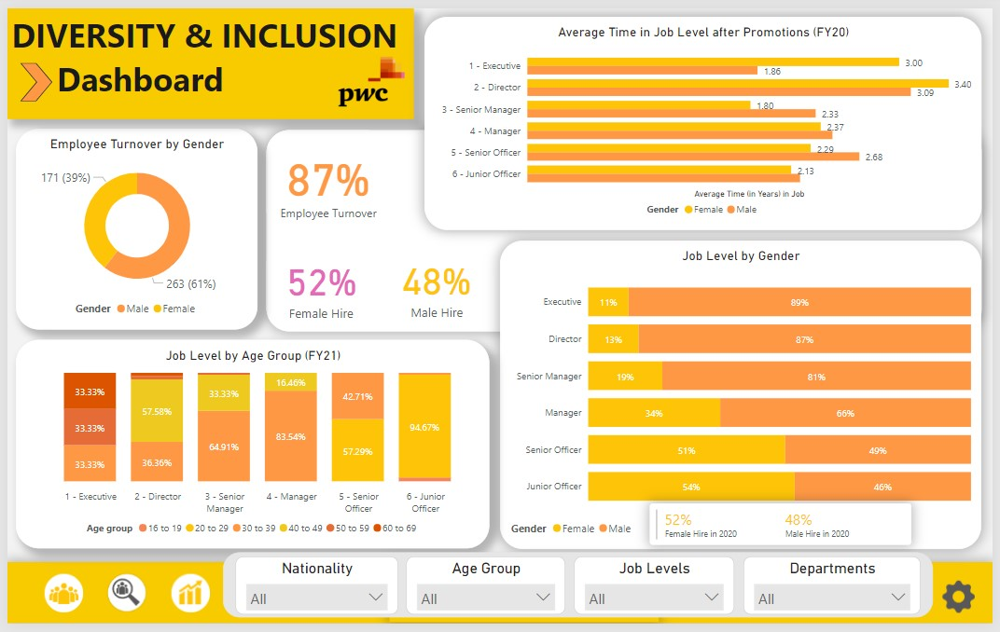
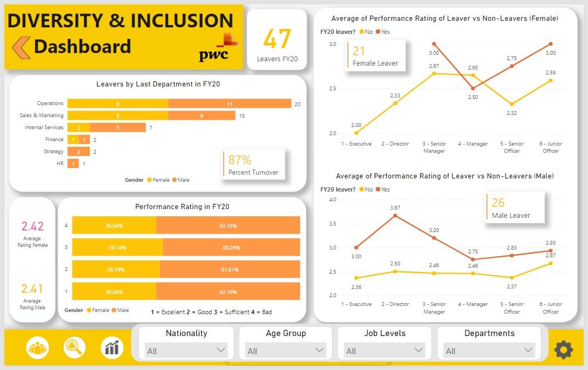

# HR Diversity & Inclusion Analysis

## Contents

- [Description](#description)
- [Project Details](#project-details)
- [Key Performance Indicators (KPIs)](#key-performance-indicators-kpis)
  - [Calculated KPIs](#some-of-the-kpis-that-were-calculated-include)
  - [What is Diversity Percentage?](#what-is-diversity-percentage)
  - [What does Turnover mean?](#what-does-turnover-mean)
  - [What is Percentage Turnover?](#what-is-percentage-turnover)
- [Data Collection](#data-collection)
- [Skills](#skills)
- [Tech Stack](#tech-stack)
- [Observations \& Insights](#observations--insights)
- [Dashboard](#dashboard)

## Description

As part of the PwC Power BI in Data Analytics Virtual Case Experience, I analyzed an HR Diversity and Inclusion dataset, designing a Power BI dashboard report and defining KPIs to measure the organization's progress. I formulated KPIs such as Diversity Ratio, Turnover Percentage, and Performance Rating to gain valuable insights. The project enabled data-driven decision-making, provided actionable insights, and facilitated continuous growth towards diversity and inclusion goals.

## Project Details

In this HR Diversity and Inclusion analysis project, I designed a Power BI dashboard report and formulated measures to define relevant KPIs to track and evaluate the organization's diversity initiatives. I analyzed various demographic characteristics, such as gender, age, nationality and utilized the data to calculate critical metrics to gain valuable insights into the organization's diversity and inclusion efforts.

To begin the analysis, I calculated the diversity ratio, comparing the number of female employees in the organization. I then created KPIs to measure the number of male and female employees in the organization, the number of leavers, the percentage of employees promoted in FY20, the percentage of women and men promoted, and the percentage of male and female employees who were newly hired during the specified period.

Other KPIs included the percentage of turnover, the average performance rating of male employees, and the average performance rating of female employees. Using these KPIs, I designed a dashboard report that provided a clear and concise overview of the organization's diversity and inclusion initiatives, including areas of strength and areas that require improvement.

Overall, this HR Diversity and Inclusion Analysis project served as a valuable tool for HR managers to evaluate and measure the organization's progress towards creating a more diverse and inclusive workplace culture. Through this project, I was able to provide actionable insights and data-driven decisions to ensure the organization's continuous growth towards diversity and inclusion goals.
 
 

  

## Key Performance Indicators (KPIs)

KPIs are measurable values that organizations use to track and evaluate their progress towards achieving specific business objectives. They are used to measure performance over time and allow organizations to make data-driven decisions based on actual results. KPIs are specific to the objectives of an organization or department and can be qualitative or quantitative. They are important metrics that help organizations identify areas for improvement, set targets for future performance, and track their success in meeting their goals.

### Some of the KPIs that were calculated include:

- **Diversity Percentage**: This KPI measures the percentage of employees in the organization who belong to a particular demographic group, such as gender, age, or nationality.
> **Diversity Percentage for Females** = (Number of Female Employees / Total Number of Employees in the Organization) x 100%

 - **Number of Male Employees**: This KPI measures the total number of male employees in the organization.

- **Number of Female Employees**: This KPI measures the total number of female employees in the organization.

- **Number of Leavers**: This KPI measures the number of employees who left the organization within a specified period.

- **Percentage of Employees Promoted in FY20**: This KPI measures the percentage of employees promoted in the organization during the financial year 2020.

- **Percentage of Women Promoted**: This KPI measures the percentage of female employees promoted in the organization during the financial year 2020.

- **Percentage of Men Promoted**: This KPI measures the percentage of male employees promoted in the organization during the financial year 2020.

- **Percentage of Hire Men**: This KPI measures the percentage of male employees who were newly hired during the specified period.

- **Percentage of Hire Women**: This KPI measures the percentage of female employees who were newly hired during the specified period.

- **Percentage Turnover in FY20**: This KPI measures the percentage of employees who left the organization during the specified period.
> Percentage Turnover = (Number of Employees who left during a period  / Total Number of Employees at the beginning of that period) x 100%

- **Average Performance Rating of Men**: This KPI measures the average performance rating of male employees in the organization.

- **Average Performance Rating of Women**: This KPI measures the average performance rating of female employees in the organization.

### **What is Diversity Percentage?** 
*Diversity Percentage* is a Key Performance Indicator (KPI) used to measure the percentage of employees in the organization who belong to a particular demographic group. By measuring diversity percentage for different demographic groups, organizations can assess the degree of diversity and inclusion within their workforce, and identify areas where representation may be lacking or where diversity and inclusion initiatives could be strengthened.

> **Diversity Percentage** = (Number of Employees from a Demographic Group / Total Number of Employees in the Organization) x 100%

Here, 
> **Diversity Percentage for Females** = (Number of Female Employees / Total Number of Employees in the Organization) x 100%

This formula calculates the percentage of female employees in the total workforce of the organization. By comparing the diversity percentages for female employees, organizations can gain insights into the representation of female employees in their workforce and identify areas where diversity and inclusion efforts may need to be focused.

### **What does Turnover mean?**
*Turnover*, in the context of business, refers to the rate at which employees leave an organisation and are replaced by new employees. Turnover is often measured over a specific period of time, such as a year, and can be expressed as a percentage or a ratio.

There are different types of turnover, such as:
- ***Voluntary Turnover*** - When an employee chooses to leave the organisation.
- ***Involuntary Turnover*** - When an employee is terminated or laid off.
- ***Functional Turnover*** - When an employee leaves but is replaced by someone who is a better fit for the job.

High turnover can be a concern for organisations, as it can lead to increased costs associated with recruitment, training, and lost productivity. Low turnover can be a positive sign for an organisation, as it may indicate that employees are satisfied with their jobs and are likely to stay with the organisation for a longer period of time.

### **What is Percentage Turnover?** 
Percentage turnover of employees, specifically refers to the percentage of employees who have left an organization during a given period of time, relative to the total number of employees who were employed by the organization at the beginning of that period. This measure is expressed as a percentage, and it provides a more focused view of the turnover of a specific group of employees. \
It is usually calculated by dividing the number of employees who left the organization during a period by the total number of employees at the beginning of that period, and then multiplying the result by 100. 

> Percentage Turnover = (Number of Employees who left during a period / Total Number of Employees at the beginning of that period) x 100% 

A high percentage turnover rate can indicate that there are issues within the organization that are causing employees to leave, such as poor management, low job satisfaction, lack of opportunities for advancement or professional development, or inadequate compensation and benefits. On the other hand, a low percentage turnover rate can indicate that the organization is doing a good job of retaining its employees.

## Data Collection

The dataset was provided as an excel file by PwC from the Human Resources department of a telecom client during PwC Power BI in Data Analytics Virtual Case Experience, which contained records of 500 employee consisting major fields like Employee ID, Gender, Age Group, Job Level after FY20 Promotions, New Hire FY20, FY20 Performance Rating, FY20 Leaver, Last Department in FY20, Time in Job Level, Promotion in FY20, Last Hire Date, etc. \
**Link:** [Dataset]()

## Skills
- Data Cleaning 
- Data Inspection 
- Data Transformation 
- Data Standardization 
- Data Visualization 

> **Data Inspection:** Visually inspecting the data to identify errors, inconsistencies, or missing values.

> **Data Transformation:** Converting data from one format or structure to another, in order to make it more   suitable for a specific task or analysis.

> **Data Standardization:** Converting data into a standard format, such as converting all text to lowercase or standardizing date formats.
## Tech Stack

- Microsoft Excel 
- Power Query
- DAX
- Microsoft Power BI

## Observations & Insights

1. There is a lack of diversity in the senior management where all senior and executive management are predominantly male, indicating there may be bias in recruitment and gender inequality in promotion.

2. Most women employees are in junior positions so, the organizations can conduct a review of recruitment and hiring practices and provide access to training and development opportunities to help women develop the skills necessary to advance into higher-level positions. This could include mentorship and sponsorship programs, leadership development programs, and cross-functional training.

3. The turnover percentage of the organization being 81%, the organizations can improve employee engagement by providing opportunities for career growth, creating a positive work environment, and providing recognition and rewards for good performance. The oragnization can also provide competitive compensation and benefits packages to attract and retain top talent. This could include salary increases, bonuses, and benefits such as healthcare, retirement plans, and paid time off. The organizations should also conduct exit interviews to understand why employees are leaving. This can help identify any common issues or concerns that may be contributing to the high turnover percentage.

4. Majority of the leavers for FY20 are from Operations and Sales & Sarketing departments, so the fact that a large number of employees are leaving these specific departments could suggest that there are issues within these areas of the business. There may be problems with management, working conditions, or employee satisfaction that are causing people to leave. It may be worth investigating the reasons for the high turnover to identify and address any underlying issues.

5. The fact that the average performance ratings for FY20 for female and male employees are very similar (2.42 for females and 2.41 for males) suggests that there may be gender equality in terms of performance within the company. This is a positive sign, as it suggests that the company is evaluating employees based on their actual performance, rather than any bias or stereotypes based on gender. However, there may be room for improvement in terms of employee performance, and it is important to be vigilant for potential biases that could impact the evaluation process.

## Dashboard

[Link to the Dashboard]()

In conclusion, this HR Diversity and Inclusion Analysis project is a critical component in measuring and tracking an organization's diversity and inclusion initiatives. The project provides valuable insights for HR managers to make data-driven decisions and take proactive steps towards creating a more diverse and inclusive workplace culture.

---